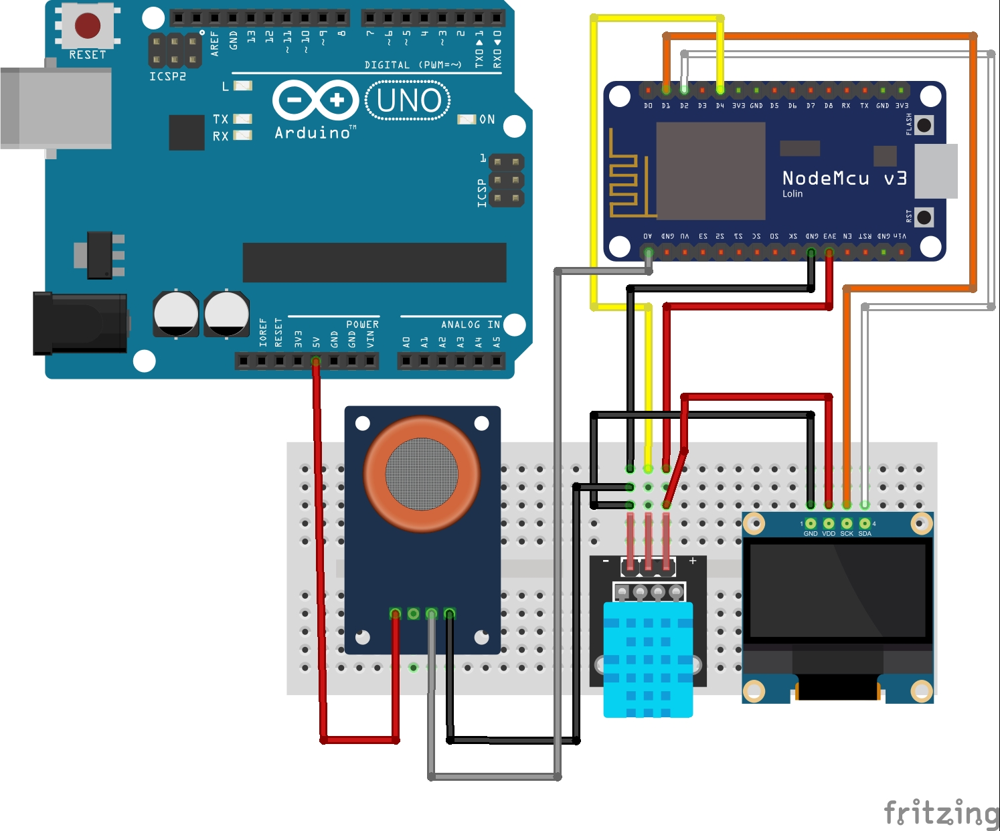

# 🌦️ Arduino WiFi Weather Station

This project creates a portable weather station that monitors temperature, humidity, and CO2 levels in the air. The data is displayed on an OLED SSD1306 screen and can also be accessed via a local web server hosted on the ESP8266 WiFi module.


## 📋 Features
- Real-time temperature and humidity monitoring (DHT11)
- Air quality/CO2 detection (MQ-135)
- Local display on 128x64 OLED screen
- Web interface accessible from any device on local network
- Compact design with ESP8266 WiFi capability

## 📦 Hardware Components
| Component | Quantity |
|-----------|----------|
| ESP8266 NodeMCU | 1 |
| DHT11 Temperature/Humidity Sensor | 1 |
| MQ-135 Air Quality Sensor | 1 |
| SSD1306 OLED Display (128x64, I2C) | 1 |
| Breadboard | 1 |
| Jumper Wires | Several |

## 🔌 Wiring Diagram

### Pin Connections
| Sensor     | ESP8266 Pin |
|------------|-------------|
| DHT11 VCC  | 3.3V        |
| DHT11 GND  | GND         |
| DHT11 DATA | D4 (GPIO2)  |
| MQ-135 VCC | 3.3V        |
| MQ-135 GND | GND         |
| MQ-135 AOUT| A0          |
| OLED VCC   | 3.3V        |
| OLED GND   | GND         |
| OLED SCL   | D1 (GPIO5)  |
| OLED SDA   | D2 (GPIO4)  |

## 🗺️ Schematic Diagram


## 📝 Source Code
[See source code](https://github.com/at-cs-ubbcluj-ro/team-project-at_schiopuadrian_tcaciucandrea/blob/main/sensors_wifi/sensors_wifi.ino)

## 🛠️ Setup Instructions

### 1. Assemble the Circuit

Connect the DHT11, MQ-135, and OLED to the ESP8266 as shown in the table above.

Refer to the schematic diagram for visual guidance:
Weather Station Schematic

### 2. Install Required Libraries
Install these libraries via Arduino IDE Library Manager:
- Adafruit SSD1306
- Adafruit GFX Library
- DHT Sensor Library
- ESP8266WiFi
- ESP8266WebServer

### 3. Upload the Code
1. Open `sensors_wifi.ino` in Arduino IDE
2. Select `NodeMCU 1.0 (ESP-12E Module)` under Tools > Board
3. Select correct COM port
4. Upload the sketch

### 3. Network Configuration
Modify these lines in the code with your WiFi credentials:
```cpp
const char* ssid = "YOUR_WIFI_SSID";
const char* password = "YOUR_WIFI_PASSWORD";
```
Modifca in the mobile app the urle with the one the app is running
```cpp
const response = await fetch('http://[ESP8266_IP]/data');
```

### 4.Test the Station
- Power the ESP8266 via USB.
- The OLED will - display initialization messages, followed by the local IP address once connected to WiFi.
- Open a web browser and navigate to the displayed IP address to view the weather data remotely or run the Mobile App and in the web browser enter the url that the app runs on. 


## 🖥️ **Interfață Web & Aplicație Mobilă Ionic**

Stația meteorologică este acum accesibilă printr-o aplicație mobilă Ionic, care preia datele de la ESP8266 și le afișează într-un mod structurat. 

### Detalii aplicație Ionic:

Aplicația Ionic se conectează la serverul web al stației (ESP8266) și afișează următoarele date:

- **Temperatura (°C)**: Valoarea temperaturii măsurate de senzorul DHT11.
- **Umiditatea (%)**: Valoarea umidității măsurate de senzorul DHT11.
- **Valoarea MQ-135 (CO2)**: Valoarea brută a senzorului MQ-135, indicând nivelurile de CO2.

Aplicația include un buton de reîncărcare pentru a obține cele mai recente date de la ESP8266.

### URL pentru serverul ESP8266:

Datele sunt accesibile la următorul URL pe rețeaua locală:
```cpp
http://[ESP8266_IP]/data
```

### Cum să folosești aplicația Ionic:

1. **Instalează aplicația Ionic**: Asigură-te că ai aplicația Ionic instalată pe telefonul tău.
2. **Conectează-te la rețeaua WiFi**: Asigură-te că atât stația meteo (ESP8266) cât și telefonul sunt conectate la aceeași rețea WiFi.
3. **Deschide aplicația**: Lansează aplicația și vei vedea valorile curente pentru temperatură, umiditate și CO2.
4. **Reîncarcă datele**: Folosește butonul „Reîncarcă” pentru a obține date actualizate de la serverul web.

## 📊 Applications
- Indoor air quality monitoring
- Greenhouse climate tracking
- Portable weather station for outdoor use
- For the full Arduino sketch, see: sensors_wifi.ino.


## 🎥 Demo


Once powered, the OLED will show real-time data, and the web interface will update every 2 seconds.

## 🤝 Team Members
- Schiopu Adrian
- Tcaciuc Andrea Elena